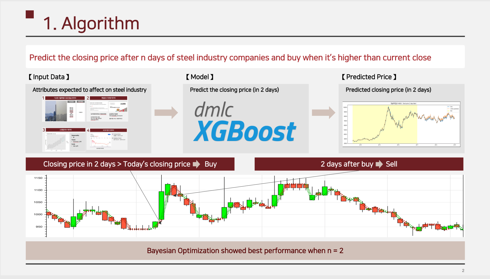
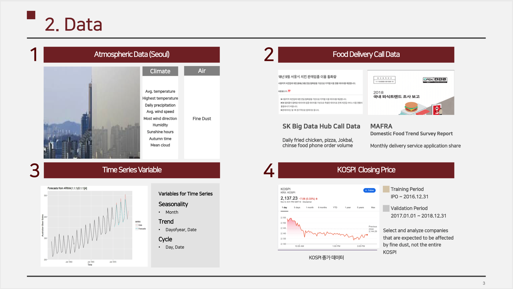
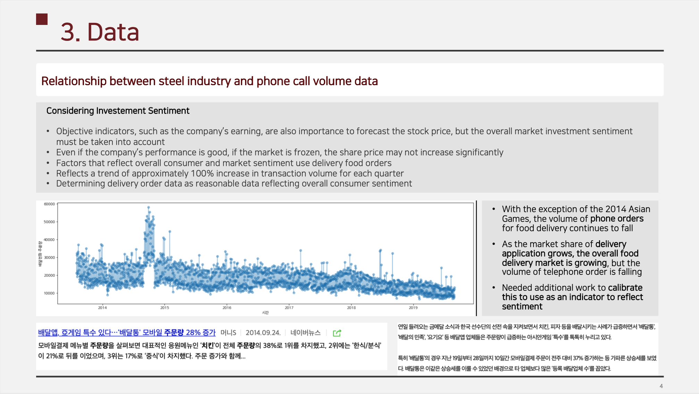
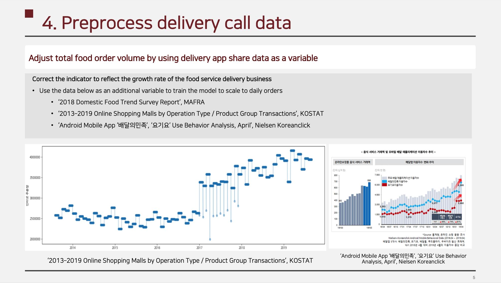
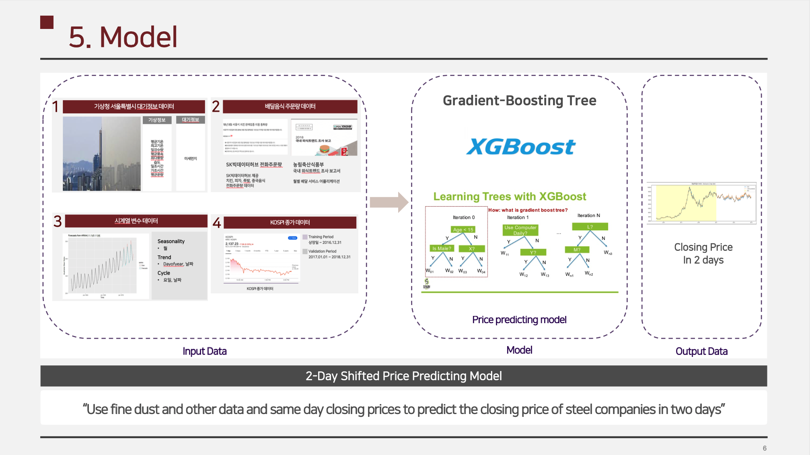
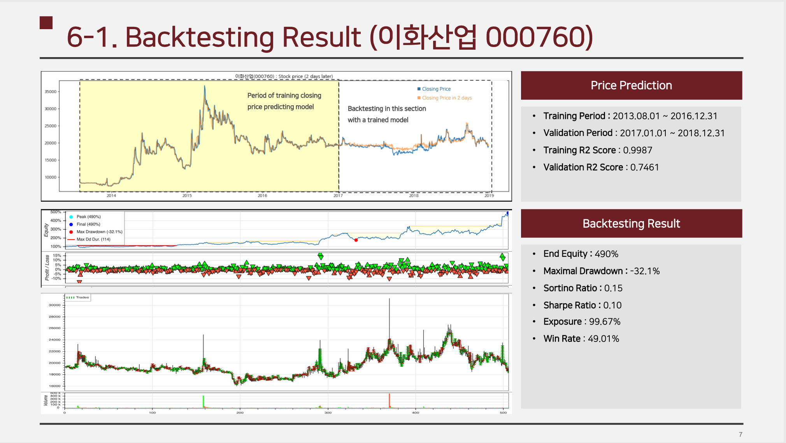
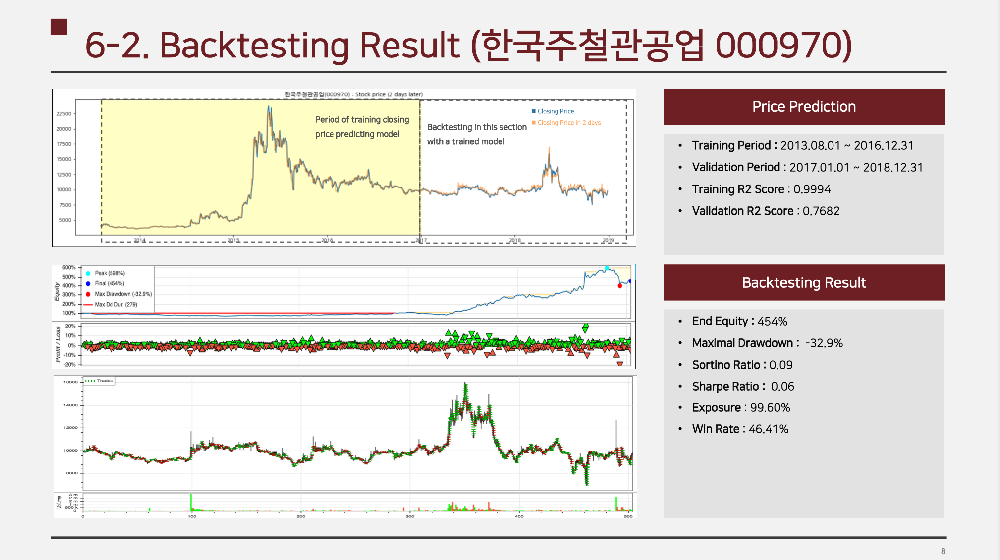
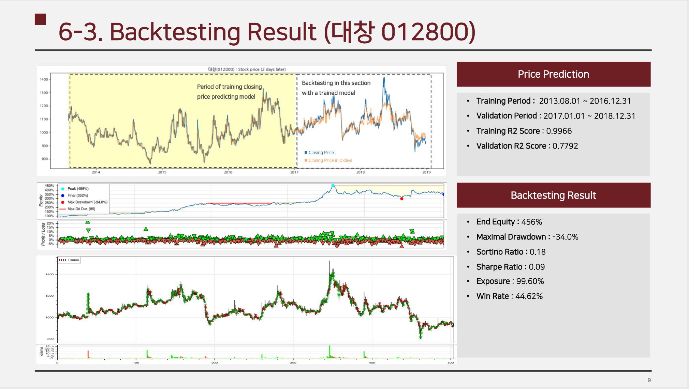
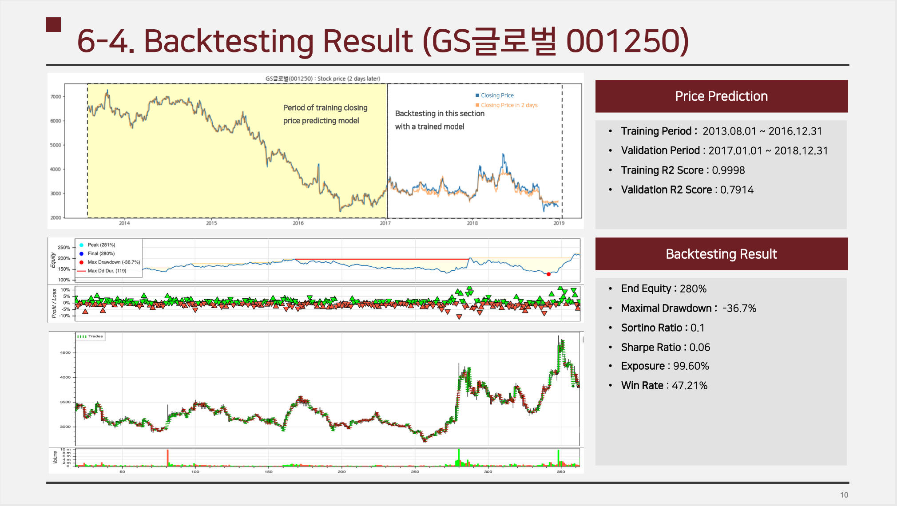

# Finedust knows

## Abstract

**If the cause of fine dust is the Korean steel industry, Fine dust observations might predict steel companies' performance**

## Summary

- Use climate and air condition data to predict closing price in n days
- Find optimal n by Bayesian Optimization to predict closing price in n days
- Buy when predicted closing price is higher than today's closing price
- Sell n days after buying

## Objective

**Maximize expected profit while having low maximal drawdown**

## Proposed Methods

## Experimental Results

- Algorithms that **generate revenue even though selected sectors do not show any particular upward trend within the validation period
- Most of the **profits are coming from the dead cat bounce at the downhill**
- **High profit** is expected while having **low expected Max. Drawdown**
- Max. Drawdown is approximately 10% of Max. Profit
- Algorithms that **catch 15-15% profitable transactions**
- On the other hand, if you're losing money, you're up to 10%, which is much less than your 15-20% profit and less frequent

## References

- 알고리즘 트레이딩 1, 2, 3, 장순용
- 파이썬으로 배우는 알고리즘 트레이딩, 조대표
- 파이썬과 케라스를 이용한 딥러닝/강화학습 주식투자, 김문권
- 머신러닝을 이용한 알고리즘 트레이딩 시스템 개발
- [backtesting.py](https://github.com/kernc/backtesting.py)
- ‘A Study on the Number of Domestic Food Delivery Services (2015)’, Jaeyoung Kwion et al.
- '2018 국내 외식 트렌드 조사 보고서’, 농림축산식품부
- ‘2013 ­ 2019 온라인 쇼핑몰별 운영형태/상품군별거래액’, 통계청
- ‘Android Mobile App ‘배달의민족’, ‘요기요’ 4월 이용 행태 분석’, Nielsen Koreanclick
